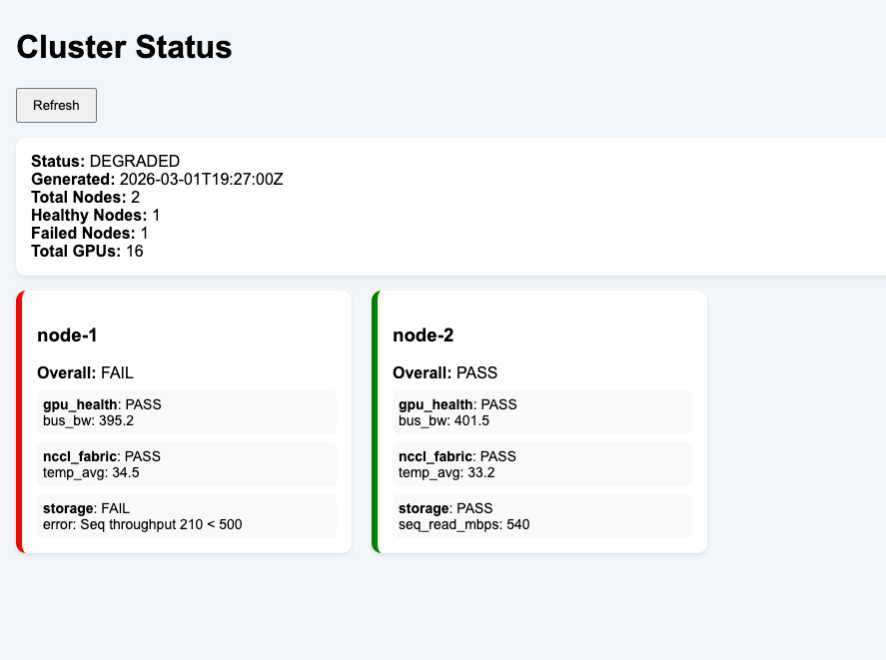

# Preflight Suite for GPU Kubernetes Clusters

This repository contains a preflight suite for validating GPU-enabled Kubernetes clusters. It includes tests for GPU health, NCCL bandwidth, storage performance, and a cluster dashboard for monitoring results.

The suite is deployed via Terraform and Helm charts and is designed to run on clusters where the user has sufficient GPU, storage, and compute resources.

## Features

- **GPU Health Check**: Validates NVIDIA drivers, GPU count, temperature, and matrix multiplication performance.
- **NCCL Bandwidth Test**: Measures inter-GPU communication performance.
- **Storage Performance Test**: Benchmarks sequential and random read throughput.
- **Telemetry Aggregation**: Consolidates node-level test results into a cluster-wide JSON report.
- **Cluster Dashboard**: Serves a simple web frontend showing cluster health and per-node status.

## Prerequisites
- Access to a Kubernetes cluster with sufficient GPU and storage resources.
- `kubectl` configured to access the target cluster (~/.kube/config).
- Terraform v1.5+ installed.
- Helm v3 installed.

⚠️ **NOTE**: This Terraform configuration has not been fully tested due to GPU resource constraints. Users are responsible for ensuring the cluster meets the minimum requirements.

## Setup Instructions

1. Clone the repository:

```bash
git clone <your-repo-url>
cd <repo-directory>
```

2. Edit Helm values (optional)

Each Helm chart has a values.yaml file in its folder (charts/*/values.yaml).
Update parameters such as:

- GPU count and driver expectations (gpu-node-health)
- NCCL message size and bandwidth thresholds (nccl-intranode-test)
- Storage thresholds (storage-performance-test)
- Dashboard PVC mount path (cluster-status)

3. Initialize Terraform

```bash
terraform init
```

4. Preview Terraform plan

```bash
terraform plan
```

This command shows the resources that will be created and the Helm releases that will be deployed.

5. Apply Terraform configuration

```bash
terraform apply
```
Confirm the action when prompted. Terraform will:
- Create a Kubernetes namespace preflight.
- Provision a PersistentVolumeClaim (preflight-results).
- Deploy all Helm charts in the correct order:
    - GPU health DaemonSet
    - NCCL intra-node test DaemonSet
    - Storage test Job
    - Telemetry aggregator Job
    - Cluster dashboard Deployment

## Accessing the Dashboard

After deployment, you can access the dashboard using port forwarding:

```bash
kubectl port-forward svc/cluster-status 8000:8000 -n preflight
```
Then open your browser:
```bash
http://localhost:8000
```

The dashboard will show:
- Cluster summary (total nodes, healthy/failed nodes)
- Per-node test results
- Test metrics for GPU, NCCL, and storage

