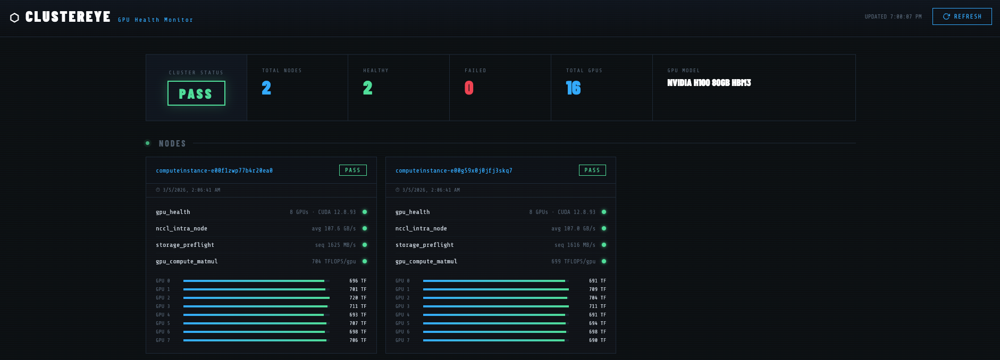

# Preflight Suite for GPU Kubernetes Clusters

This repository provides a set of **Argo Workflows** designed to run validation tests on **GPU-enabled Kubernetes clusters**. The goal of these workflows is to verify that GPUs, storage, and distributed communication components are functioning correctly before workloads are scheduled on the cluster.

The following tests are executed:

- **GPU health check**\
Validates GPU availability and configuration (e.g., driver version, number of GPUs per node).

- **I/O test**\
Performs sequential read/write benchmarks to validate storage performance.

- **Compute test**\
Runs a simple matrix multiplication workload to verify GPU compute capability.

- **NCCL test**\
Executes the `all_reduce_perf` benchmark to validate GPU-to-GPU communication using NCCL.

- **Node policy enforcement**\
Applies node labels or taints if tests fail, allowing problematic nodes to be excluded from scheduling.

**Argo Workflows** orchestrates the execution order and manages dependencies between these tests.

## Requirements

Before running the workflows, ensure the following tools and components
are available:

-   `kubectl` is installed and configured to access the target
    Kubernetes cluster
-   **Argo CLI** is installed (Installation instructions can be found [here](./docs/configurations.md))
-   **Argo Workflows** is installed on the Kubernetes cluster (Installation instructions can be found [here](./docs/configurations.md))


## Running the Workflow

Follow these steps to configure and run the workflow.

1.  Install **Argo Workflows** on the Kubernetes cluster.
2.  Install the **Argo CLI** on your local machine or management server.
3.  Edit the configuration file `config/params.yaml`. Adjust parameters according to your environment.
4.  Edit the PVC configuration: `workflows/pvc.yaml`

Configuration instructions can be found [here](./docs/configurations.md)

### Create the Persistent Volume Claim (PVC)

After editing `pvc.yaml`, apply it to the cluster:

``` bash
kubectl apply -f workflows/pvc.yaml
```

This PVC will store the test results generated by the workflows.

### Create Service Accounts

Two service accounts are required:

1.  **Argo Workflow Service Account** -- used to run workflow pods
2.  **Node Policy Service Account** -- used to label or taint nodes when tests fail

Create them using:

``` bash
kubectl apply -f workflows/argo_workflow_rbac.yaml
kubectl apply -f workflows/node_policy_rbac.yaml
```

### Apply Workflow Templates

This project uses **nested workflow templates** to ensure that tests run sequentially and dependencies are preserved.

Apply the templates located in the `templates` directory:

``` bash
kubectl apply -f workflows/templates/
```

Then apply the main workflow template:

``` bash
kubectl apply -f workflows/preflight_workflow.yaml
```

### Submitting the Workflow

Use the **Argo CLI** to submit the workflow:

``` bash
argo submit --from workflowtemplate/preflight-tests --parameter-file config/params.yaml
```

This command uses the workflow templates already installed in the cluster and overrides default parameters using values from `params.yaml`

### Checking Workflow Status

You can monitor workflow execution using the following commands:

``` bash
argo list
argo get <workflow_name>
```

You can also inspect the underlying Kubernetes pods:

``` bash
kubectl get pods
kubectl describe pod <pod_name>
kubectl logs <pod_name>
```

## Accessing Test Results

Test results are stored in the **PVC**. To access them, create a temporary pod that mounts the same PVC.

``` bash
kubectl apply -f - <<EOF
apiVersion: v1
kind: Pod
metadata:
  name: preflight-test-pod
spec:
  containers:
  - name: test-container
    image: ubuntu:latest
    command: ["sleep", "infinity"]
    volumeMounts:
    - name: workspace-volume
      mountPath: /results
  volumes:
  - name: workspace-volume
    persistentVolumeClaim:
      claimName: preflight-tests-workspace
EOF
```

Enter the container:

``` bash
kubectl exec -it preflight-test-pod -- /bin/sh
```

Inside the container, navigate to: `/results`

You will find result files for each node: `<nodename>-results.json`


## Copying Results to Your Local Machine

To copy the results from the pod:

``` bash
kubectl cp preflight-test-pod:/results/<nodename>-results.json <nodename>-results.json
```

## Cluster Dashboard
The repository also provides a static frontend showing the cluster and node status. To deploy the dashboard, apply the `dashboard_pod.yaml` and `dashboard_service.yaml` files without changing any values.
```bash
kubectl apply -f workflows/dashboard/
```

Then use Kubernetes port forwarding to access the dashboard locally:
```bash
kubectl port-forward svc/gpu-dashboard 8000:8000
```

Then open `http://localhost:8000` in your browser to see the dashboard:




## Planned Improvements

-   Clean up temporary files generated during the storage test
-   Improve `params.yaml` configuration to support:
    -   Dynamic PVC names
    -   Dynamic Kubernetes labels
    -   Dynamic namespaces
    -   Dynamic service account names
    -   Dynamic GPU resource requests and limits